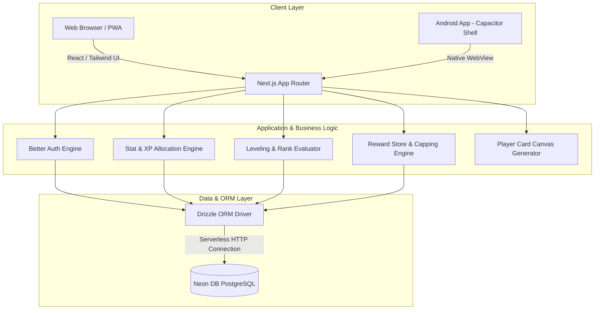
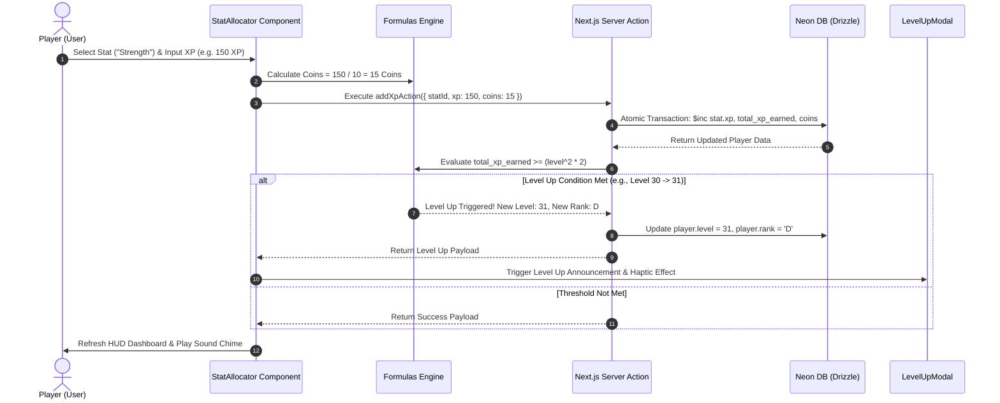
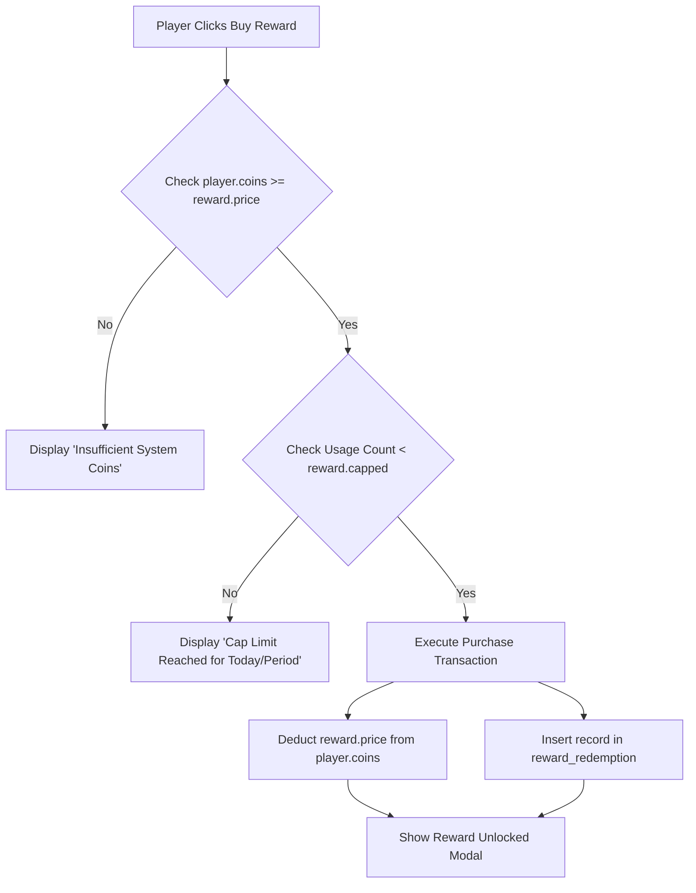
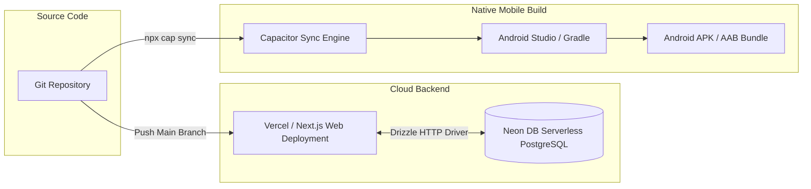

# System Architecture Specification

**Document Name:** `architecture.md`  
**Application Name:** Solo Leveling System App  
**Target Platforms:** Web (Next.js PWA) & Android (Capacitor Native Shell)  

---

## 1. High-Level System Architecture



---

## 2. Technology Stack & Component Responsibilities

| Tier / Layer | Technology | Primary Function |
| :--- | :--- | :--- |
| **Frontend Framework** | Next.js 14+ (App Router, TypeScript) | Page routing, server-rendered components, client state management |
| **UI & Styling** | Tailwind CSS + Framer Motion | Cyberpunk dark HUD UI, glowing badges, level-up animations |
| **Mobile Runtime** | Capacitor (`@capacitor/core`, `@capacitor/android`) | Android APK packaging, native haptics, local notifications |
| **Authentication** | Better Auth (`better-auth`) | Email/password & OAuth authentication, session management |
| **Database** | Serverless PostgreSQL (Neon DB) | Cloud database for players, stats, rewards, and auth data |
| **ORM** | Drizzle ORM | Type-safe SQL queries, migrations, and schema management |
| **Card Export** | `html-to-image` / HTML5 Canvas | Converts Player Card DOM component into downloadable PNG |

---

## 3. Directory & Module Architecture

```
g:/Projects/sistam/
├── android/                   # Capacitor generated native Android studio project
├── public/                    # Static assets (avatars, sound effects, system badges)
├── src/
│   ├── app/                   # Next.js App Router pages & API routes
│   │   ├── (auth)/            # Auth routes (login, register)
│   │   ├── api/
│   │   │   ├── auth/[...all]/ # Better Auth API route handler
│   │   │   └── player/        # API endpoints for player stats & actions
│   │   ├── dashboard/         # Main System HUD dashboard
│   │   ├── store/             # Real-world Reward Store page
│   │   ├── layout.tsx         # Global root layout with theme providers
│   │   └── page.tsx           # Landing page / Hunter status view
│   ├── components/            # UI Components
│   │   ├── PlayerCard.tsx     # Shareable Hunter Status Card
│   │   ├── StatAllocator.tsx  # Form to manually add XP to stats
│   │   ├── LevelUpModal.tsx   # Animated Solo Leveling level-up popup
│   │   ├── RewardStore.tsx    # Shop catalog & purchase modal
│   │   └── ui/                # Base Shadcn / custom UI elements
│   ├── db/                    # Database configuration
│   │   ├── index.ts           # Neon DB connection initialization
│   │   └── schema.ts          # Drizzle ORM tables & relations
│   ├── lib/                   # Utility functions & shared logic
│   │   ├── auth.ts            # Better Auth client/server setup
│   │   ├── formulas.ts        # Leveling (L^2 * 2) & Coin (XP/10) formulas
│   │   └── rank.ts            # Hunter Rank calculation rules (E to S)
│   └── types/                 # Global TypeScript definitions
├── capacitor.config.json      # Capacitor native configuration file
├── drizzle.config.ts          # Drizzle Kit migration configuration
├── tailwind.config.js         # Tailwind theme & color definitions
├── PRD.md                     # Product Requirements Document
├── concept.md                 # Concept & Design Philosophy
├── databse.md                 # Database Architecture & Schemas
└── architecture.md            # System Architecture (This file)
```

---

## 4. Key Data Flows & Logic Pipelines

### 4.1 Manual XP Entry & Leveling Pipeline



---

### 4.2 Reward Purchase & Capping Flow



---

## 5. Mobile Packaging Architecture (Capacitor)

### 5.1 Web to Native Android Bridge
- Next.js builds static or server-handled web bundle (`out` directory or static export).
- **Capacitor Android Shell** embeds the web application inside a native Chrome WebView instance.
- **Native Plugin Integration**:
  - `@capacitor/haptics`: Vibrates phone during Level Up modal triggers.
  - `@capacitor/local-notifications`: Reminds user to complete and log physical notebook quests.
  - `@capacitor/share`: Shares generated Player Card image natively via Android Share Sheet (WhatsApp, Instagram, Telegram).

---

## 6. Deployment & Environment Pipeline



### Build Commands:
- **Run Web Dev**: `npm run dev`
- **Database Push**: `npx drizzle-kit push`
- **Build Web**: `npm run build`
- **Sync to Android**: `npx cap sync android`
- **Open Android Studio**: `npx cap open android`
