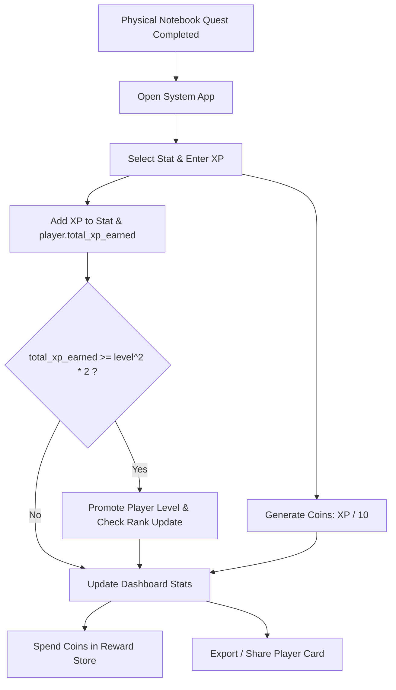

# System (Solo Leveling inspired) - Concept Document

> **"Rise. Level up your real life."**

---

## 1. Executive Summary & Vision

The **System App** is a gamified personal growth and productivity application inspired by the iconic UI/UX system from *Solo Leveling*. 

Unlike traditional habit trackers that require inputting full task details digitally, this application is designed for a **Hybrid Analog-Digital Workflow**:
- **Analog Execution**: You write and check off your daily quests, workouts, reading targets, and chores in a physical notebook.
- **Digital Rewards & Analytics**: You log into the System App to manually distribute earned Experience Points (XP) across your attributes, level up your hunter status, earn System Coins, spend coins on real-life rewards, and generate a shareable **Player Card**.

---

## 2. Core Philosophy & Design Aesthetic

### 2.1 The "Solo Leveling" Aesthetic
- **Visual Theme**: Deep midnight dark mode (`#0B0E14`), electric blue (`#00F0FF`), glowing purple (`#7000FF`), and gold (`#FFD700`) accents.
- **UI Language**: Futuristic HUD boxes, crisp typography, sci-fi borders, glowing stat counters, and dramatic level-up modal announcements.

### 2.2 Hybrid Workflow
1. **Quest Execution (Notebook)**: Write daily tasks on paper (e.g., "100 Push-ups", "Read 20 pages", "Code 2 hours").
2. **XP Calculation (Manual Entry)**: Assign an XP value to completed physical quests and input the XP directly into the relevant stats in the app.
3. **System Feedback**: The app calculates leveling progress, distributes coins, tracks daily login/logging streaks, and updates your hunter rank.

---

## 3. Core Mechanics & Formulas

### 3.1 XP & Leveling Formula
To level up from your current level $L$ to level $L+1$, the required XP threshold is calculated using the quadratic formula:

$$\text{XP Required} = L^2 \times 2$$

#### Example Calculation:
- At **Level 30**, the XP required to reach **Level 31** is:
  $$\text{XP Required} = 30^2 \times 2 = 900 \times 2 = 1,800\text{ XP}$$

When your `total_xp_earned` reaches or exceeds the cumulative threshold, the System triggers a **Level Up** announcement, incrementing your `level`.

### 3.2 System Coins Conversion
Every time you manually enter XP into a stat, the System generates coins according to the formula:

$$\text{Coins Earned} = \frac{\text{XP Entered}}{10}$$

#### Example:
- Entering **150 XP** for the *Strength* stat grants **15 System Coins** ($\frac{150}{10} = 15$).

### 3.3 Hunter Rank Matrix
Ranks reflect your overall hunter prowess and are automatically unlocked as your player level grows:

| Rank | Level Range | Status Title |
| :--- | :--- | :--- |
| **E-Rank** | Level 1 – 10 | Novice Hunter |
| **D-Rank** | Level 11 – 25 | Evolving Hunter |
| **C-Rank** | Level 26 – 50 | Seasoned Hunter |
| **B-Rank** | Level 51 – 75 | Elite Hunter |
| **A-Rank** | Level 76 – 99 | High Hunter |
| **S-Rank** | Level 100+ | Monarch / National Level |

---

## 4. Key Application Modules

### 4.1 Shareable Player Card
A stylized, downloadable/shareable image card displaying:
- Player Avatar & Name
- Join Date & Current Streak (days)
- Player Level & Hunter Rank (E to S)
- Total XP Earned & System Coins Balance
- Radar chart / stat list of individual attribute levels

### 4.2 Stat Allocation Module
Interface to select any registered stat (e.g., *Fitness, Coding, Knowledge, Discipline*) and input earned XP. Updates both stat-specific XP/Level and global player total XP.

### 4.3 Reward Store (System Shop)
A custom shop where players configure real-world rewards (e.g., "Cheat Meal", "1 Hour Video Games", "Buy a Book") with specified coin prices and daily/weekly usage caps.

---

## 5. Summary Flowchart

