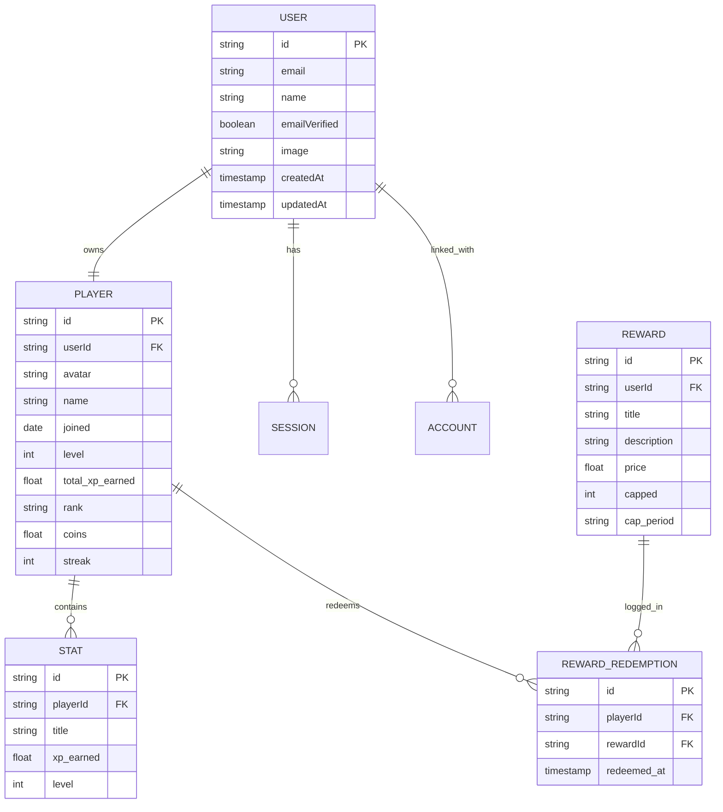

# Database Architecture & Schema Specification

**Document Name:** `databse.md`  
**Database Engine:** PostgreSQL (Serverless on Neon DB)  
**ORM / Data Access:** Drizzle ORM / Prisma  
**Authentication Engine:** Better Auth (`better-auth`)  

---

## 1. Entity-Relationship Overview



---

## 2. Data Models & Field Specifications

### 2.1 Authentication Schemas (Better Auth Managed)

Better Auth handles user accounts, sessions, and OAuth providers automatically in Neon DB PostgreSQL.

- **`user`**: Stores authentication identity (`id`, `email`, `name`, `emailVerified`, `image`, `createdAt`, `updatedAt`).
- **`session`**: Active user tokens (`id`, `userId`, `token`, `expiresAt`, `ipAddress`, `userAgent`).
- **`account`**: OAuth provider credentials (Google, GitHub, etc.).
- **`verification`**: Email verification / password reset tokens.

---

### 2.2 Player Schema (`player`)

Stores player identity, hunter status, currency, streak metrics, linked directly to the Better Auth `user.id`.

| Field Name | Data Type | Constraints & Defaults | Description |
| :--- | :--- | :--- | :--- |
| `id` | UUID / Text | Primary Key | Unique player identifier |
| `userId` | Text / UUID | Foreign Key `user(id)`, UNIQUE | Links to Better Auth User |
| `avatar` | String | Default: default avatar URL | Hunter avatar image |
| `name` | String | Required | Display name |
| `joined` | Date / Timestamp | Default: `NOW()` | System registration date |
| `level` | Integer | Default: `1`, Min: `1` | Player current level |
| `total_xp_earned` | Double Precision | Default: `0.0`, Min: `0` | Total XP earned across all stats |
| `rank` | Enum (`E`,`D`,`C`,`B`,`A`,`S`) | Default: `'E'` | Hunter Rank classification |
| `coins` | Double Precision | Default: `0.0`, Min: `0` | Spendable System Coins |
| `streak` | Integer | Default: `0`, Min: `0` | Consecutive logging streak (days) |

---

### 2.3 Stats Schema (`player_stat`)

Individual attribute progression linked to a player.

| Field Name | Data Type | Constraints & Defaults | Description |
| :--- | :--- | :--- | :--- |
| `id` | UUID / Text | Primary Key | Stat entry ID |
| `playerId` | UUID / Text | FK `player(id)` ON DELETE CASCADE | Associated player |
| `title` | String | Required | Stat name (e.g. "Strength", "Coding") |
| `xp_earned` | Double Precision | Default: `0.0` | Total XP accumulated in this stat |
| `level` | Integer | Default: `1` | Calculated level for this stat |

---

### 2.4 Rewards Schema (`reward`) & Redemptions (`reward_redemption`)

| Field Name | Data Type | Constraints & Defaults | Description |
| :--- | :--- | :--- | :--- |
| `id` | UUID / Text | Primary Key | Reward item ID |
| `userId` | UUID / Text | FK `user(id)` ON DELETE CASCADE | Creator of custom reward |
| `title` | String | Required | Reward title (e.g. "Cheat Meal") |
| `description` | String | Optional | Description / rules |
| `price` | Double Precision | Required, Min: `0` | Cost in System Coins |
| `capped` | Integer | Required, Min: `1` | Max uses per period |
| `cap_period` | Enum (`daily`, `weekly`, `monthly`, `total`) | Default: `'daily'` | Limit interval |

---

## 3. Drizzle ORM Schema (`src/db/schema.ts`) for Neon DB + Better Auth

```typescript
import { pgTable, text, integer, doublePrecision, timestamp, pgEnum, unique } from 'drizzle-orm/pg-core';

// Enums
export const rankEnum = pgEnum('rank', ['E', 'D', 'C', 'B', 'A', 'S']);
export const capPeriodEnum = pgEnum('cap_period', ['daily', 'weekly', 'monthly', 'total']);

// --- Better Auth Tables ---
export const user = pgTable('user', {
  id: text('id').primaryKey(),
  name: text('name').notNull(),
  email: text('email').notNull().unique(),
  emailVerified: integer('emailVerified').notNull(),
  image: text('image'),
  createdAt: timestamp('createdAt').notNull(),
  updatedAt: timestamp('updatedAt').notNull()
});

export const session = pgTable('session', {
  id: text('id').primaryKey(),
  userId: text('userId').notNull().references(() => user.id, { onDelete: 'cascade' }),
  token: text('token').notNull().unique(),
  expiresAt: timestamp('expiresAt').notNull(),
  ipAddress: text('ipAddress'),
  userAgent: text('userAgent')
});

export const account = pgTable('account', {
  id: text('id').primaryKey(),
  userId: text('userId').notNull().references(() => user.id, { onDelete: 'cascade' }),
  accountId: text('accountId').notNull(),
  providerId: text('providerId').notNull(),
  accessToken: text('accessToken'),
  refreshToken: text('refreshToken'),
  expiresAt: timestamp('expiresAt')
});

export const verification = pgTable('verification', {
  id: text('id').primaryKey(),
  identifier: text('identifier').notNull(),
  value: text('value').notNull(),
  expiresAt: timestamp('expiresAt').notNull()
});

// --- System App Core Tables ---
export const player = pgTable('player', {
  id: text('id').primaryKey().$defaultFn(() => crypto.randomUUID()),
  userId: text('userId').notNull().unique().references(() => user.id, { onDelete: 'cascade' }),
  avatar: text('avatar').notNull().default('/avatars/default_hunter.png'),
  name: text('name').notNull(),
  joined: timestamp('joined').notNull().defaultNow(),
  level: integer('level').notNull().default(1),
  totalXpEarned: doublePrecision('total_xp_earned').notNull().default(0),
  rank: rankEnum('rank').notNull().default('E'),
  coins: doublePrecision('coins').notNull().default(0),
  streak: integer('streak').notNull().default(0)
});

export const playerStat = pgTable('player_stat', {
  id: text('id').primaryKey().$defaultFn(() => crypto.randomUUID()),
  playerId: text('playerId').notNull().references(() => player.id, { onDelete: 'cascade' }),
  title: text('title').notNull(),
  xpEarned: doublePrecision('xp_earned').notNull().default(0),
  level: integer('level').notNull().default(1)
});

export const reward = pgTable('reward', {
  id: text('id').primaryKey().$defaultFn(() => crypto.randomUUID()),
  userId: text('userId').notNull().references(() => user.id, { onDelete: 'cascade' }),
  title: text('title').notNull(),
  description: text('description'),
  price: doublePrecision('price').notNull(),
  capped: integer('capped').notNull().default(1),
  capPeriod: capPeriodEnum('cap_period').notNull().default('daily')
});

export const rewardRedemption = pgTable('reward_redemption', {
  id: text('id').primaryKey().$defaultFn(() => crypto.randomUUID()),
  playerId: text('playerId').notNull().references(() => player.id, { onDelete: 'cascade' }),
  rewardId: text('rewardId').notNull().references(() => reward.id, { onDelete: 'cascade' }),
  redeemedAt: timestamp('redeemed_at').notNull().defaultNow()
});
```

---

## 4. Neon DB Connection Setup (`src/db/index.ts`)

```typescript
import { neon } from '@neondatabase/serverless';
import { drizzle } from 'drizzle-orm/neon-http';
import * as schema from './schema';

const sql = neon(process.env.DATABASE_URL!);
export const db = drizzle(sql, { schema });
```

---

## 5. XP & Coin Increment Mutation Logic

```typescript
import { db } from '@/db';
import { player, playerStat } from '@/db/schema';
import { eq, sql } from 'drizzle-orm';

export async function addXpToStat(playerId: string, statId: string, xpAmount: number) {
  const coinsEarned = xpAmount / 10;

  // 1. Transaction to update stat, player total XP, and coins atomically
  await db.transaction(async (tx) => {
    // Update individual stat
    await tx
      .update(playerStat)
      .set({
        xpEarned: sql`${playerStat.xpEarned} + ${xpAmount}`
      })
      .where(eq(playerStat.id, statId));

    // Update player totals
    const [updatedPlayer] = await tx
      .update(player)
      .set({
        totalXpEarned: sql`${player.totalXpEarned} + ${xpAmount}`,
        coins: sql`${player.coins} + ${coinsEarned}`
      })
      .where(eq(player.id, playerId))
      .returning();

    // 2. Evaluate Level Up condition: level^2 * 2
    let currentLevel = updatedPlayer.level;
    let requiredXp = Math.pow(currentLevel, 2) * 2;

    while (updatedPlayer.totalXpEarned >= requiredXp) {
      currentLevel++;
      requiredXp = Math.pow(currentLevel, 2) * 2;
    }

    if (currentLevel !== updatedPlayer.level) {
      const newRank = calculateRank(currentLevel);
      await tx
        .update(player)
        .set({ level: currentLevel, rank: newRank })
        .where(eq(player.id, playerId));
    }
  });
}

function calculateRank(level: number): 'E' | 'D' | 'C' | 'B' | 'A' | 'S' {
  if (level >= 100) return 'S';
  if (level >= 76)  return 'A';
  if (level >= 51)  return 'B';
  if (level >= 26)  return 'C';
  if (level >= 11)  return 'D';
  return 'E';
}
```
